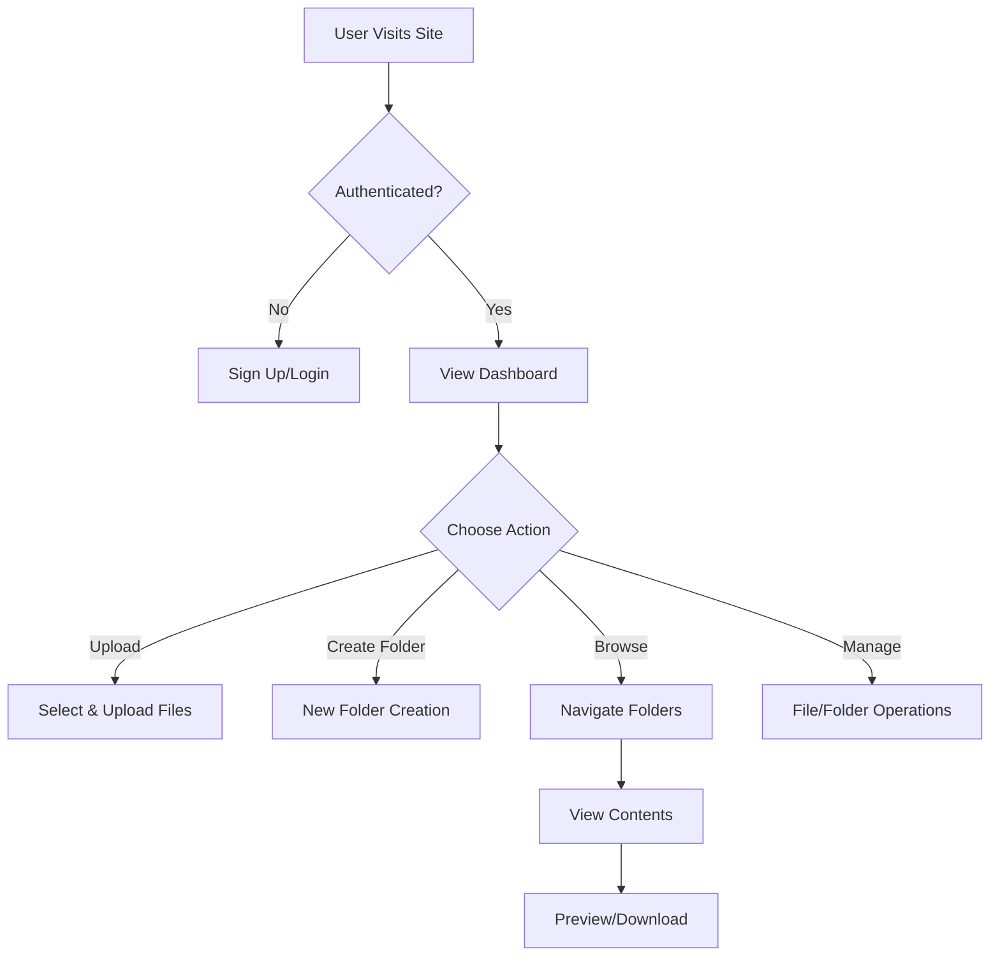

# Google Drive Clone Product Context

## Purpose & Problems Solved

### Core Purpose
This Google Drive clone aims to provide users with a simplified but functional cloud storage solution that demonstrates modern web development practices and architectures.

### Problems Solved
1. **File Accessibility**
   - Users need access to their files from anywhere
   - Files need to be organized in a logical structure
   - Quick file retrieval and management

2. **Collaboration & Sharing**
   - Personal file storage and management
   - Future expansion possibility for file sharing

3. **Security**
   - Secure file storage
   - Protected user data
   - Authentication-based access

## User Experience Goals

### 1. Intuitive Navigation
- Clear folder hierarchy
- Breadcrumb navigation
- Drag-and-drop support (future enhancement)
- Familiar file explorer interface

### 2. Quick Actions
- Upload files with progress indication
- Create folders instantly
- Rename/delete with confirmation
- Preview files without download

### 3. Responsive Design
- Seamless mobile experience
- Desktop-optimized views
- Consistent functionality across devices

### 4. Performance
- Fast file listing
- Efficient upload handling
- Quick preview loading
- Smooth transitions

## User Flow

## Key Interactions

### Authentication
1. Simple sign-up with email
2. Secure login process
3. Easy logout

### File Management
1. Upload:
   - Select files
   - See upload progress
   - Receive confirmation

2. Organization:
   - Create folders
   - Move files (future)
   - Rename items
   - Delete with confirmation

3. Navigation:
   - Click through folders
   - Use breadcrumbs
   - Search (future enhancement)

4. Preview:
   - View images directly
   - PDF preview
   - File information display

## Success Metrics
- User signup completion rate
- File upload success rate
- System response time
- User session duration
- File organization adoption

## Future Enhancements
1. File sharing capabilities
2. Advanced search functionality
3. Drag-and-drop interface
4. Collaborative features
5. Version control