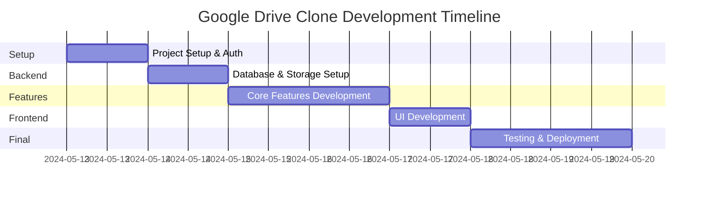

# Project Progress Tracker

## Current Status: Initial Planning Phase

### Project Timeline

## Implementation Status

### ⌛ Pending Implementation
1. **Project Infrastructure**
   - [ ] Next.js project initialization
   - [ ] TypeScript configuration
   - [ ] TailwindCSS setup
   - [ ] Development environment setup

2. **Authentication System**
   - [ ] Clerk integration
   - [ ] Protected routes
   - [ ] User session management

3. **Database & Storage**
   - [ ] PostgreSQL database setup
   - [ ] Prisma configuration
   - [ ] AWS S3 bucket creation
   - [ ] Storage service implementation

4. **Core Features**
   - [ ] Folder creation
   - [ ] File upload system
   - [ ] File/folder operations
   - [ ] Preview functionality

5. **User Interface**
   - [ ] Navigation components
   - [ ] File/folder views
   - [ ] Responsive design
   - [ ] Loading states

6. **Testing & Deployment**
   - [ ] Unit tests
   - [ ] Integration tests
   - [ ] Production deployment
   - [ ] Environment configuration

### ✅ Completed
- Initial project planning
- Architecture design
- Technology stack selection
- Documentation setup

### 🚧 In Progress
- Project setup and initialization

## Known Issues
*(To be populated as development progresses)*

## Technical Decisions Log

### 2024-05-12
1. **Framework Selection**
   - Chosen: Next.js with App Router
   - Reason: Better performance, SEO, and developer experience

2. **Authentication Solution**
   - Chosen: Clerk
   - Reason: Comprehensive auth features and easy integration

3. **Database Choice**
   - Chosen: PostgreSQL with Prisma
   - Reason: Type safety and robust relationships

4. **File Storage**
   - Chosen: AWS S3
   - Reason: Reliable and scalable solution

5. **UI Framework**
   - Chosen: TailwindCSS with shadcn/ui
   - Reason: Customizable and maintainable components

## Project Evolution

### Phase 1: Foundation (Current)
- Project setup
- Core infrastructure
- Basic file operations

### Phase 2: Enhancement
- Advanced file operations
- Performance optimization
- User experience improvements

### Phase 3: Future Features
- File sharing
- Collaboration tools
- Advanced search functionality

## Metrics & Goals

### Performance Targets
- Page load time: < 2s
- File upload speed: 1MB/s minimum
- API response time: < 100ms

### Quality Metrics
- Test coverage: > 80%
- TypeScript strict mode
- Zero critical security vulnerabilities

## Deployment Status
*(To be updated during deployment phase)*

## Feedback & Iterations
*(To be populated as development progresses)*