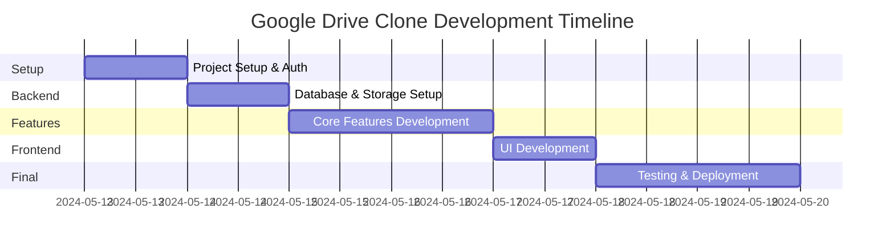

# Project Progress Tracker

## Current Status: Implementation Phase

### Project Timeline

## Implementation Status

### ✅ Completed Implementation
1. **Project Infrastructure**
   - [x] Next.js project initialization
   - [x] TypeScript configuration
   - [x] TailwindCSS setup
   - [x] Development environment setup

2. **Authentication System**
   - [x] Clerk integration
   - [x] Protected routes
   - [x] User session management

3. **Database & Storage**
   - [x] SQLite database setup
   - [x] Prisma configuration
   - [x] Cloudinary integration
   - [x] Storage service implementation

4. **Core Features**
   - [x] Folder creation and navigation
   - [x] File upload with progress tracking
   - [x] File/folder rename operations
   - [x] File deletion with cleanup
   - [x] Image and PDF preview
   - [x] File metadata display

5. **User Interface**
   - [x] Navigation components
   - [x] Grid/list view for files
   - [x] Responsive design
   - [x] Loading states
   - [x] Action dropdown menus
   - [x] Preview modals

### 🚧 In Progress
1. **Feature Enhancements**
   - [ ] Drag-and-drop file upload
   - [ ] File search functionality
   - [ ] Bulk operations
   - [ ] Advanced file sorting

2. **User Experience**
   - [ ] Toast notifications
   - [ ] Improved error handling
   - [ ] Mobile navigation refinements
   - [ ] Loading state improvements

3. **Testing & Deployment**
   - [ ] Unit test implementation
   - [ ] Integration test setup
   - [ ] Production deployment
   - [ ] Monitoring setup

## Known Issues
1. **Performance**
   - Large folder loading needs optimization
   - Preview generation for large files can be slow

2. **UI/UX**
   - Mobile navigation needs improvement
   - Missing error notifications
   - No drag-and-drop support yet

3. **Features**
   - Search functionality not implemented
   - Bulk operations not available
   - No file sharing capability

## Technical Decisions Log

### 2024-05-13
1. **Framework Selection**
   - Chosen: Next.js with App Router
   - Reason: Better performance, SEO, and developer experience

2. **Authentication Solution**
   - Chosen: Clerk
   - Reason: Comprehensive auth features and easy integration

3. **Database Choice**
   - Chosen: SQLite with Prisma
   - Reason: Lightweight, portable, and zero-configuration

4. **File Storage**
   - Chosen: Cloudinary
   - Reason: Built-in optimization and simple integration

5. **UI Framework**
   - Chosen: TailwindCSS with shadcn/ui
   - Reason: Customizable and maintainable components

## Project Evolution

### Phase 1: Foundation (Current)
- Project setup
- Core infrastructure
- Basic file operations

### Phase 2: Enhancement
- Advanced file operations
- Performance optimization
- User experience improvements

### Phase 3: Future Features
- File sharing
- Collaboration tools
- Advanced search functionality

## Metrics & Goals

### Performance Targets
- Page load time: < 2s
- File upload speed: 1MB/s minimum
- API response time: < 200ms (local SQLite)

### Quality Metrics
- Test coverage: > 80%
- TypeScript strict mode
- Zero critical security vulnerabilities

## Deployment Status
*(To be updated during deployment phase)*

## Feedback & Iterations
*(To be populated as development progresses)*