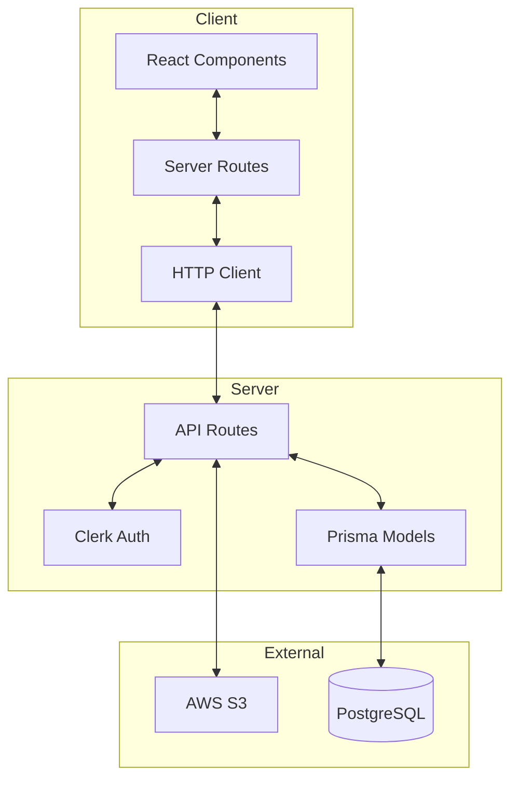
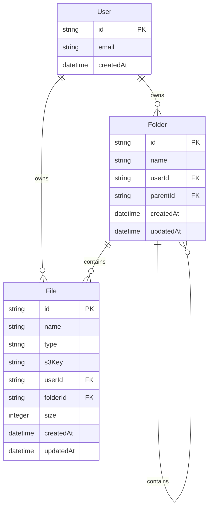
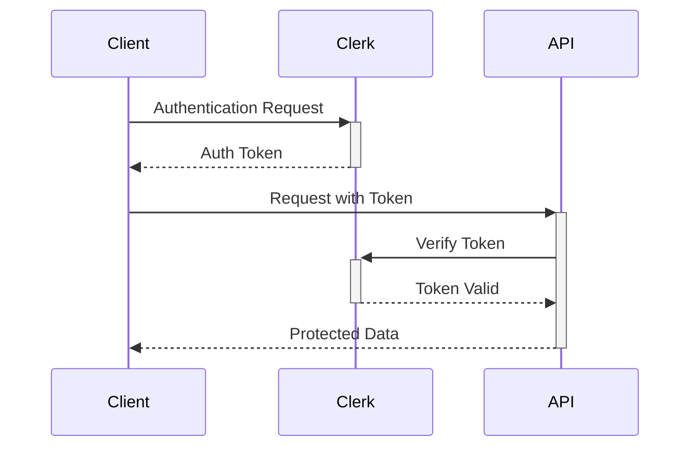
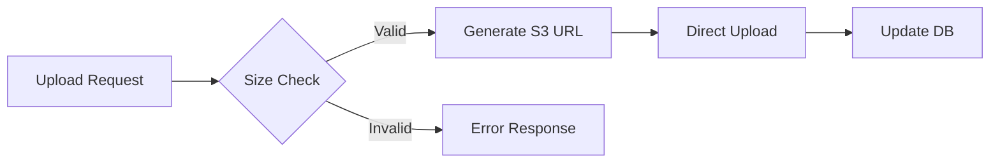

# System Architecture & Patterns

## System Architecture



## Design Patterns

### 1. Frontend Patterns

#### Component Architecture
- **Atomic Design Pattern**
  - Atoms: Basic UI elements (buttons, inputs)
  - Molecules: Combined UI elements (search bars, file cards)
  - Organisms: Complex UI sections (file lists, navigation)
  - Templates: Page layouts
  - Pages: Complete views

#### State Management
- **Server State**: NextJS Server Components
- **Client State**: React Context + Hooks
- **Form State**: React Hook Form

#### Data Fetching
- Server Components for initial data
- React Query for client-side updates
- Optimistic updates for better UX

### 2. Backend Patterns

#### API Architecture
- **RESTful API Design**
  - Resource-based routing
  - Standard HTTP methods
  - Consistent error handling

#### Database Schema


### 3. Security Patterns

#### Authentication Flow


#### Authorization Rules
- Role-based access control
- Resource ownership validation
- Route protection middleware

### 4. Storage Patterns

#### File Handling


#### Metadata Management
- Separate metadata from file storage
- Efficient querying patterns
- Cascading deletions

### 5. Error Handling

#### Error Types
- ValidationError
- AuthenticationError
- StorageError
- DatabaseError

#### Error Response Format
```typescript
interface ErrorResponse {
  code: string;
  message: string;
  details?: Record<string, any>;
}
```

## Performance Patterns

### 1. Caching Strategy
- Server-side caching
- Browser caching
- Static asset optimization

### 2. Loading States
- Skeleton loading
- Progressive loading
- Infinite scroll for large lists

### 3. Optimization Techniques
- Image optimization
- Code splitting
- Lazy loading
- Debounced operations

## Implementation Guidelines

### 1. Code Organization
```
src/
├── app/
│   ├── (auth)/
│   └── (dashboard)/
├── components/
│   ├── ui/
│   └── features/
├── lib/
│   ├── utils/
│   └── db/
└── types/
```

### 2. Naming Conventions
- PascalCase for components
- camelCase for functions/variables
- kebab-case for files/folders
- UPPER_CASE for constants

### 3. Testing Strategy
- Unit tests for utilities
- Integration tests for API routes
- E2E tests for critical paths